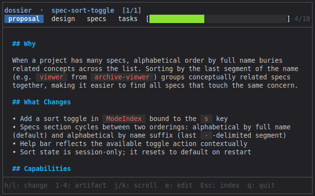

**English** | **[Español](README.es.md)**

# dossier

A keyboard-driven terminal UI for reading and navigating [OpenSpec](https://github.com/openspec) project artifacts — proposals, designs, specs, and tasks.

> Built with OpenSpec. This repository contains 12 project-level spec files and 20+ archived changes that document the complete development history of the tool.

<p align="center">
  
</p>

---

## Features

- Navigates all active changes and their artifacts from a single interface
- Renders Markdown with full syntax highlighting
- Toggles task checkboxes (`- [ ]` / `- [x]`) in-place, writing directly to `tasks.md`
- Live-reloads on disk changes (500 ms polling)
- Opens any artifact in `$EDITOR`
- Accepts a path argument to view a single change directory without a full project

---

## Installation

**Requirements:** Go 1.25 or later, terminal with ANSI color support.

```bash
# From source
git clone https://github.com/fselich/dossier
cd dossier
make build    # produces ./dossier
make install  # installs via go install

# Using go install
go install github.com/fselich/dossier/cmd/dossier@latest
```

---

## Usage

Run from the root of an OpenSpec project:

```bash
dossier
```

View a single change directory by path:

```bash
dossier /path/to/openspec/changes/my-change
```

### Keyboard reference

#### Normal mode (viewing a change)

| Key | Action |
|---|---|
| `h` / `l` | Previous / next change |
| `1` | Proposal tab |
| `2` | Design tab |
| `3` | Specs tab (press again to cycle through multiple spec files) |
| `4` | Tasks tab |
| `j` / `down` | Scroll down (or move task cursor down) |
| `k` / `up` | Scroll up (or move task cursor up) |
| `Space` | Toggle task under cursor (tasks tab only) |
| `e` | Open artifact in `$EDITOR` |
| `a` / `Esc` | Enter index mode |
| `q` / `Ctrl+C` | Quit |

#### Index mode (change and spec navigator)

| Key | Action |
|---|---|
| `j` / `down` | Move cursor down |
| `k` / `up` | Move cursor up |
| `Enter` | Open selected change, spec, or archived change |
| `Space` | Expand / collapse a project spec |
| `q` / `Esc` / `Ctrl+C` | Quit |

#### Archive mode (viewing an archived change)

| Key | Action |
|---|---|
| `1`–`4` | Switch artifact tab |
| `j` / `k` | Scroll |
| `a` / `Esc` | Return to index |
| `q` / `Ctrl+C` | Quit |

#### Spec viewer mode

| Key | Action |
|---|---|
| `j` / `k` | Scroll |
| `Esc` | Return to index |
| `q` / `Ctrl+C` | Quit |

In requirement focus mode:

| Key | Action |
|---|---|
| `h` / `l` | Previous / next requirement |
| `j` / `k` | Scroll |
| `Esc` | Return to index |
| `q` / `Ctrl+C` | Quit |

---

## Project structure

dossier expects an `openspec/` directory at the project root:

```
openspec/
├── changes/
│   ├── <change-name>/
│   │   ├── .openspec.yaml   # Required: identifies the directory as a change
│   │   ├── proposal.md
│   │   ├── design.md
│   │   ├── tasks.md         # GFM checkbox syntax: - [ ] / - [x]
│   │   └── specs/
│   │       └── <spec-name>/
│   │           └── spec.md
│   └── archive/
│       └── YYYY-MM-DD-<name>/
└── specs/
    └── <spec-name>/
        └── spec.md          # Requirements parsed from: ### Requirement: <name>
```
